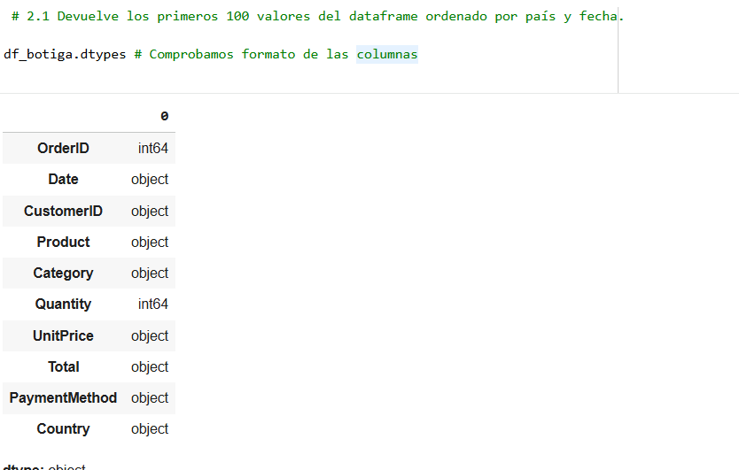
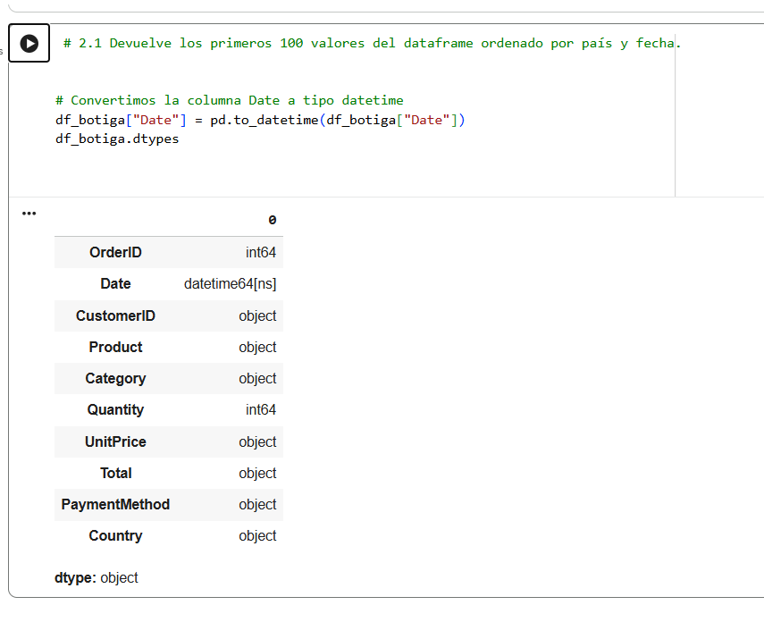

# Ejercicio 2

Una tienda On-Line de productos de oficina nos ha pedido procesar la información que tienen almacenada en un archivo .csv (`botiga_en_linia.csv`).  
El archivo se encuentra en la carpeta Data.

- 2.1: (0,5 puntos) Devuelve los primeros 100 valores del dataframe ordenado por país y fecha.

- 2.2: (0,5 puntos) En primer lugar, se quiere crear una nueva columna en el dataframe para la Fecha, en formato dd/mm/yyyy.

- 2.3: (0,5 puntos) Crea una función llamada `Retorna_productes_categoria` que reciba como parámetro de entrada una categoría determinada en formato texto y devuelva un diccionario con todos los productos que pertenecen a la categoría introducida y el total de productos vendidos.

- 2.4: (0,5 puntos) Crea una función llamada `Import_total_tipus_pagament` que reciba como parámetros de entrada un método de pago, una fecha de inicio y una fecha de fin, y que devuelva el importe total vendido del método de pago entre las fechas seleccionadas.  
El formato de salida debe ser como el del ejemplo:  
“Por el método de pago Transferencia, se han cobrado 12030,02 Euros entre el 01/01/2025 y el 09/09/2025”.

Recuerda mostrar los resultados por pantalla en cada subapartado.

### 2.1 

## Primer error

Al importar el archivo csv me da este error:

busco información en:

enlace información: https://stackoverflow.com/questions/5552555/unicodedecodeerror-invalid-continuation-byte

## Solución: 

Ejecuto dtypes para comprobar el formato de las columnas, veo que el formato de fecha es objeto, por lo que transformo el formato a datatime

### 2.2 

Como ya está en formato datatime la columna Date, solo hay que cambiar el formato. Creo la columna y le doy formato usando el comando dt.strftime.

