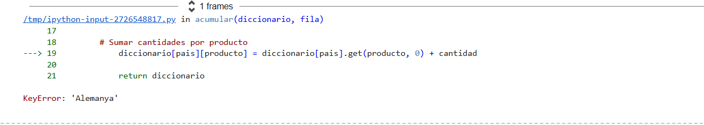
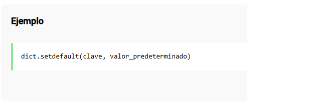

### 3. # Ejercicio 3

Nos piden también crear una función que recorra todo el archivo `botiga_en_linia.csv`.

La función, llamada `create_dictionary`, recibirá como *entrada*: 

- La ruta que contiene el archivo de datos en formato *.csv*.  
- El código de un cliente (`CustomerId`).

La *salida* será un diccionario donde:

- Cada clave debe contener el país.  
- El valor correspondiente a cada clave será una lista de tuplas.  
  La lista debe contener todos los productos vendidos a ese cliente y país (total de productos).

**Nota importante:**  
Utiliza los principios de **programación funcional** que hemos visto en teoría para resolver este ejercicio.

#### Primer Error:

### Solución

Consulto:

[KeyError según doc. oficial](https://docs.python.org/es/3/tutorial/datastructures.html#dictionaries)

En la documentación oficial de Python especifica que el KeyError aparece cuando se intenta acceder a una clave que no existe. 

[Consulto como solucionarlo](https://thedataschools.com/python/diccionarios/setdefault-metodo-diccionario.html)

Según nuestra  consulta, un método efectivo para solucionar el error es usar setdefault (). En el diccionario de claves que
estamos creando en la función, este método establecerá un valor predeterminado para una clave en caso de que no exista en el diccionario. 

#### NOTA

Tenía dudas acerca de la salida en cuanto a las listas, tras consultar en el foro ví que ya se habían resuelto y opto por intentar sacar una salida acorde con la que se espera.

