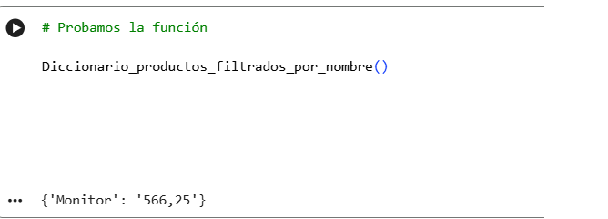
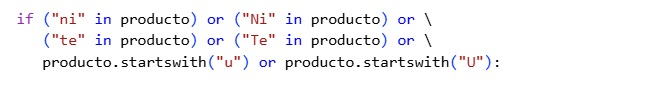
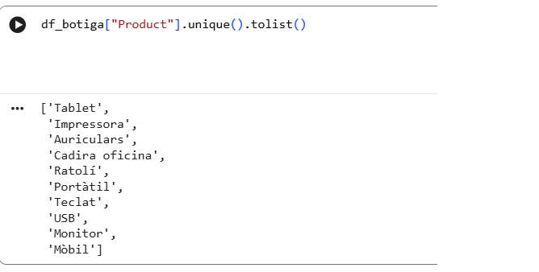

### Ejercicio 4

A continuación, se quiere crear una función que devuelva un nuevo diccionario que contendrá, como clave, todos los productos que contengan la combinación de palabras "ni" o "te" o que empiecen por la letra "u".
Para cada producto encontrado, el valor del diccionario será el precio unitario.

#### Primera prueba de la función

Algo no cuadra en la salida, me suenan más productos como USB y no sale en la lista, para asegurarme saco una lista de productos

Deberían haber salido USB, que empieza por "u" o Teclat, que contiene "te". Caigo en la cuenta de que están en mayúsculas, así que opto por la solución de añadir las combinaciones de palabras también en mayúsculas, y el comienzo por la letra "U" en mayúsculas.

#### Solución

La solución es simnple, me da curiosidad a ver que otras soluciones puede haber para solucionar el problema de mayúsculas y minúsculas en las cadenas de texto.

Doy con el método lower(): https://j2logo.com/python/convertir-a-mayusculas-y-minusculas-en-python/
