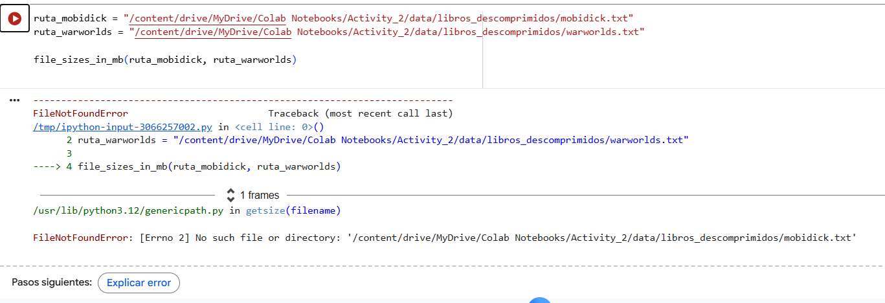
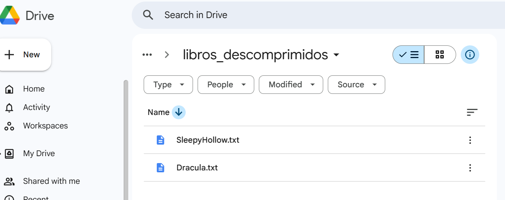
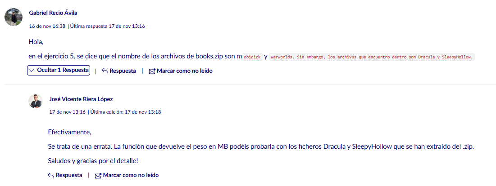
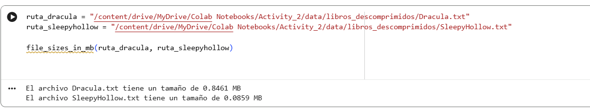
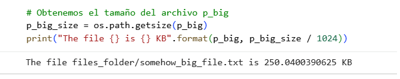

### Ejercicio 5

Uno de los objetivos de la PAC será el tratamiento de archivos.
Como podéis comprobar, la carpeta Data contiene un archivo llamado books.zip.

Se pide, por tanto, crear dos funciones diferentes que realicen las siguientes operaciones:

5.1 (0,5 puntos): Escribe una función llamada zip_decompression que reciba dos parámetros de entrada: la ruta y el nombre del archivo zip donde está ubicado, y el nombre de la carpeta donde se quieren descomprimir los archivos.
5.2 (0,5 puntos): Escribe una función que reciba como parámetros la ruta y el nombre de los archivos extraídos (mobidick y warworlds) y que devuelva el tamaño de estos archivos en megabytes.
Recuerda también mostrar por pantalla el resultado obtenido por esta función.

### Ejercicio 5.1

Para hacer la función, miro en los notebooks de apuntes, en el archivo 3 aparece un ejemplo de código usando la función del módulo OS: mkdir(), que sirve para crear una carpeta

![Ejemplo apuntes)(pantallazo_ejercicio_5-b_pec_2.png)

#### Primer error

Primer susto, me aparece un error que no encuentra los libros en la carpeta donde se suponían debían estar. En el enunciado del ejercicio solo pide que tenemos que crear la carpeta, así que lo hago de la forma más sencilla posible. 
Entiendo que se debería hacer alguna verificación antes, 

Bueno, es que los que buscaba no son los que tengo en la carpeta, así que me voy a foro a ver si a alguien le ha pasado esto.

Pues sí, era una errata del enunciado:

Pruebo la salida con los nombres correctos:

### Ejercicio 5.2

Aquí hay que obtener el tamaño de los archivos que hemos creado en el ejercicio anterior al descomprimr el archivo zip. En los apuntes, archivo 3, tenemos la solución usando el submódulo path, usando getsize para obtener el tamaño.

Como getsize () nos da el tamaño en bytes y en el enunciado nos lo pide en MB, hay que convertirlos usando la fórmula: Como `os.path.getsize()` devuelve el tamaño en bytes y el enunciado pide mostrarlo en megabytes, es necesario convertir la unidad usando la siguiente fórmula:

\[
\text{MB} = \frac{\text{bytes}}{1024 \times 1024}
\]

1 MB = 1024 KB y 1 KB = 1024 bytes.
